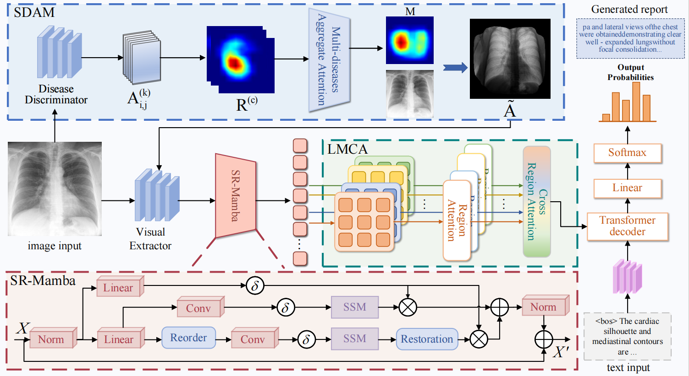

# Enhanced Radiology Report Generation via Comprehensive Sequence Rearrangement and Multi-scale Cross-region Attention
#### *by: Yan Deng* , Wenfeng Zhang , Qibing Qin, Wei Hu, Jianming Hu, Dengwei Yan

## About

We propose a radiology report generation model based on comprehensive  sequence rearrangement with multi-scale cross-region Attention (CSR-LMCA). 
## Datasets
We used two public datasets (IU X-Ray and MIMIC-CXR) in this study :
- For [Iu X-Ray](https://drive.google.com/file/d/1c0BXEuDy8Cmm2jfN0YYGkQxFZd2ZIoLg/view?usp=sharing) ,  you can download the dataset and then put the files in data/iu_xray.
- For [MIMIC-CXR](https://drive.google.com/file/d/1DS6NYirOXQf8qYieSVMvqNwuOlgAbM_E/view?usp=sharing),  you can download the dataset and then put the files in data/MIMIC-CXR.

We used weights for sdam module can download [there](https://pan.baidu.com/s/17etHuU7W8T3CJfAHTjtTAw?pwd=p8rv )

## How to Use

1. **Prepare the Data**: 
Organize your datasets under the `data/` directory as follows:
<pre><code> data/ 
├── iu_xray/ # Place IU X-ray dataset here 
│ └── images/ # Image files 
│ └── annotation.json 
├── mimic/ # Place MIMIC-CXR dataset here 
│ └── images/ # Image files
│ └── annotation.json 
└── sdam/ # Store model weights and threshold config files for SDAM preprocessing </code></pre>
2. **Set Up the Environment**: 
Install all required dependencies using:
```bash
pip install -r requirements.txt
```
3. **Preprocess with SDAM**:
Run SDAM preprocessing to generate Grad-CAM-based attention maps:
```bash
python sdam_preprocess.py
```
4. **Training the Model**:
   - Navigate to the root directory of the project.
   - Run the training by executing the following command:
     ```bash
     python main_train.py
     ```
   - Run the testing by executing the following command:
     ```bash
     python main_test.py
     ```

## Python Environment
Please install the following core dependencies before running the project:
- torch==2.1.1+cu118  
- torchvision==0.16.1+cu118  
- torchaudio==2.1.1+cu118  
- transformers==4.41.2  
- timm==1.0.9  
- tokenizers==0.19.1  
- numpy==1.24.4  
- opencv-python==4.10.0.84  
- tqdm==4.66.5  
- spacy==2.3.9  
- mamba_ssm==1.1.3

## References
```bash
[1] Deng, Y., Zhang, W., Qin, Q., Hu, W., Hu, J., and Yan, D., " Enhanced Radiology Report Generation via Comprehensive Sequence Rearrangement and Multi-scale Cross-region Attention " The Visual Computer
```
